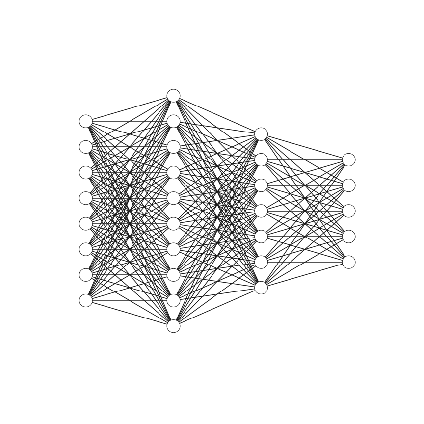
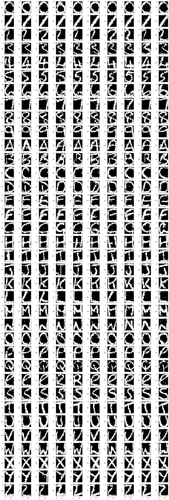

# Deep Neural network from scratch

Representation of a DNN

This repository implements deep neural networks from scratch using numpy. We test this network on the MNIST dataset.

We also implement unsupervised models such as Restricted Boltzman Machines (RBM) and Deep Belief Networks (DBN). We also use this models to generate data.
We use DBN to pretrain our DNN and achieve better results.

Digits generated with DBN

